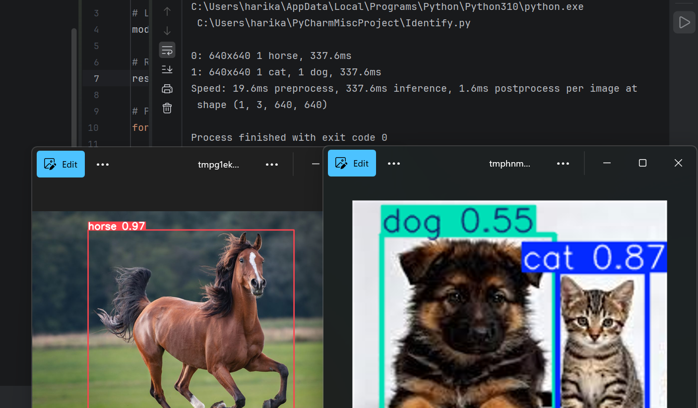

# 🐴 Animal Identification using AI 🤖
An AI-based image classification project that identifies animals (such as cats and horses) from input images using computer vision and deep learning techniques.

## 🚀 Features
-  Image-based animal detection  
-  AI-powered classification  
-  Fast and accurate predictions  
-  Supports multiple animal classes  

## ⚙️ Technologies Used
- Python  
- TensorFlow / YOLO  
- OpenCV 
- NumPy  

## 🧠 How it Works
The model is trained on a dataset of animal images.  
When a new image is given as input, the system processes it and predicts the animal category using a trained AI model.

## 📸 Demo

## 👩‍💻 Author
Harika
